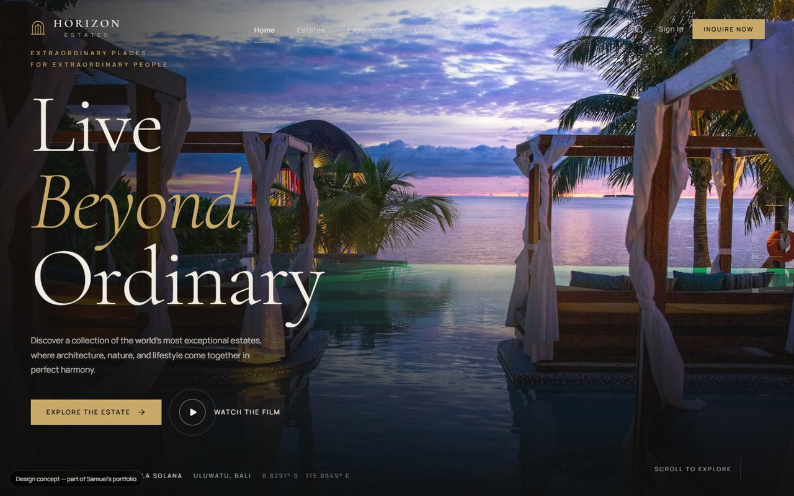
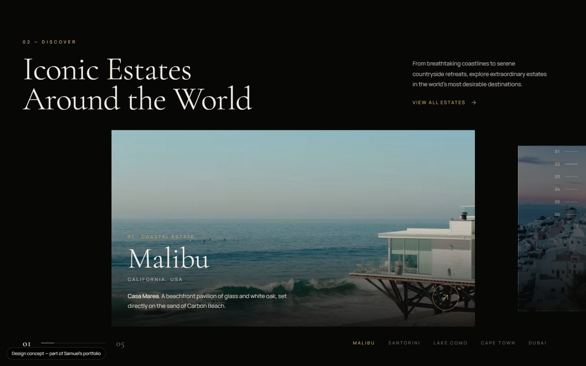

# Horizon Estates

Cinematic real-estate showcase — a single scroll that walks a buyer from the gate to the private collection. React 19 + TypeScript + Vite, Tailwind CSS v4, Framer Motion, Lucide icons.

**Live:** https://horizon-estates-tau.vercel.app



```bash
npm install
npm run dev      # http://localhost:5173
npm run build    # production build in dist/
```

## The journey

`src/sections/` holds one file per chapter, in scroll order: `Arrival` → `CinematicHero` → `EstateScroller` → `EnterHome` → `InteriorExperience` → `LifestyleSection` → `FeaturedEstate` → `ArchitectureStory` → `ExperienceExplorer` → `DestinationExplorer` → `PrivateCollection` → `FinalCTA`, with `Intro` playing the title card before the first paint.

Two of these carry most of the choreography. `EstateScroller` pins itself and moves the estates sideways as you scroll down on a desktop, and swaps to a swipeable gallery on touch. `EnterHome` expands a clip-path so the façade opens into the interior.

## Structure

- `src/components/` — chrome and shared motion pieces: `Navbar`, `SectionProgress` (the side chapter nav), `CustomCursor`, `Magnetic`, `MaskImage`, `SplitLines`, `Reveal`, `Img`, `Overlays`, `Footer`.
- `src/data/content.ts` — every estate, interior, experience and destination (edit content here, not in sections). `worldDots.ts` is a pre-computed land-dot grid for the destination map, generated offline so no map library ships to the browser.
- `src/hooks/` — `useSectionProgress`, `useMediaQuery` (`useImmersive()` gates the desktop-only cinema tier).
- `src/lib/` — `image.ts` (Unsplash CDN URLs + `srcset`), `ui.ts` (easing, scroll helpers, overlay state).
- Design tokens live in the `@theme` block of `src/index.css` — Tailwind v4, so there is no `tailwind.config.js`.

## Notes

`useSectionProgress` wraps `useScroll` in an identity `useTransform`. That is deliberate: without it Framer hands scroll-linked values to the browser's native ScrollTimeline, and multi-stop ranges desync from the scroll position.

Motion respects `prefers-reduced-motion` through `MotionConfig reducedMotion="user"`, and the custom cursor and pinned horizontal scroll only run on a desktop with a fine pointer.

Images are served from the Unsplash CDN with a blurred low-quality placeholder behind each one; swap the photo ids in `content.ts` for the client's own photography before launch.

## Screens

| Iconic estates scroller | On a phone |
| --- | --- |
|  |  |
